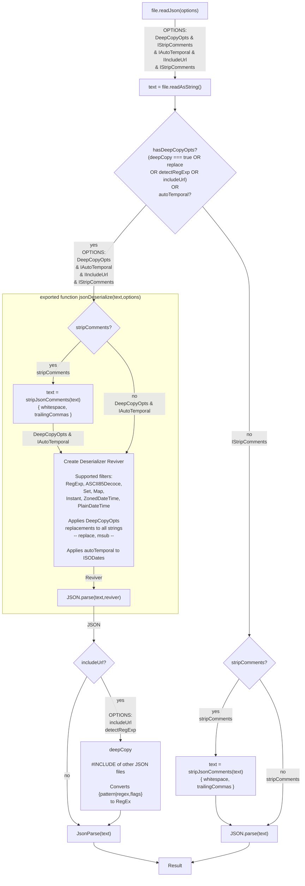
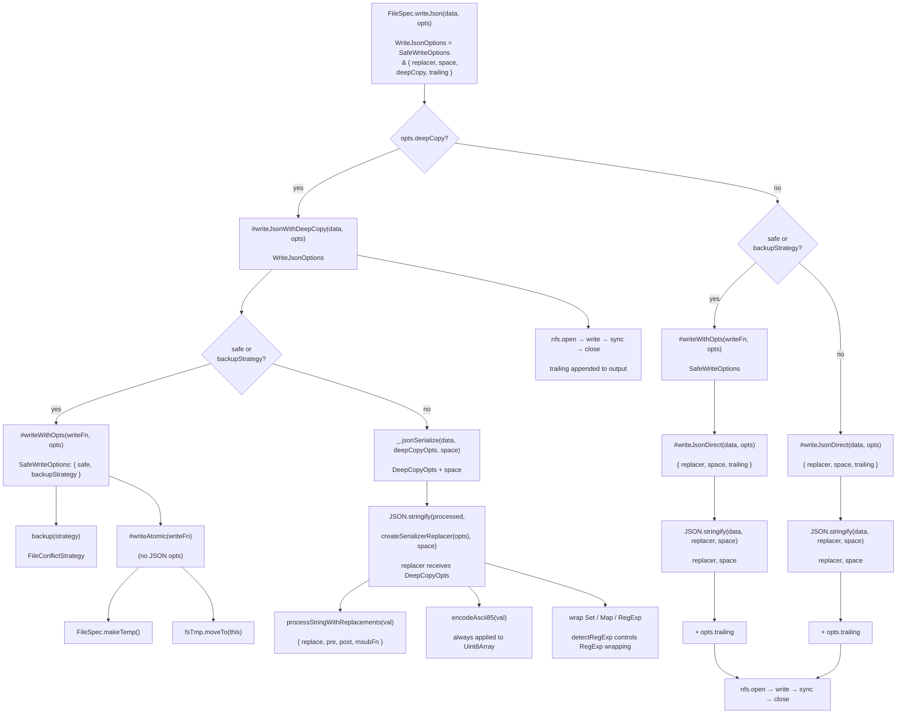

# readJson and writeJson Call Graphs

## readJson — Call Graph



### readJson Options

```
ReadJsonOptions = DeepCopyOpts & IStripComments & IAutoTemporal & IIncludeUrl
```

| Option          | Set            | Type                                | Default | Consumed By                                           |
| --------------- | -------------- | ----------------------------------- | ------- | ----------------------------------------------------- |
| `stripComments` | IStripComments | `boolean \| IStripJsonComments`     | —       | `stripJsonComments` (via `jsonDeserialize` or direct) |
| `autoTemporal`  | IAutoTemporal  | `boolean`                           | —       | `createDeserializerReviver` → `asTemporal()`          |
| `pre` / `post`  | DeepCopyOpts   | `string`                            | —       | `processStringWithReplacements`                       |
| `replace`       | DeepCopyOpts   | `Record<string, string \| unknown>` | —       | `processStringWithReplacements`                       |
| `msubFn`        | DeepCopyOpts   | `MSubFn`                            | —       | `processStringWithReplacements`                       |
| `detectRegExp`  | DeepCopyOpts   | `boolean`                           | —       | `#deepCopy` → `_.asRegExp`                            |
| `includeUrl`    | IIncludeUrl    | `unknown`                           | —       | `#deepCopy` (fs-level recursive read)                 |

**IStripJsonComments** (nested under `stripComments`):

| Sub-option       | Type      | Default | Purpose                                  |
| ---------------- | --------- | ------- | ---------------------------------------- |
| `whitespace`     | `boolean` | `true`  | Preserve whitespace in comment positions |
| `trailingCommas` | `boolean` | `false` | Remove trailing commas before `}` / `]`  |

---

## writeJson — Call Graph



### writeJson Options

```
WriteJsonOptions = SafeWriteOptions & { replacer, space, deepCopy, trailing }
SafeWriteOptions = { safe, backupStrategy }
```

| Option           | Type                      | Default | Consumed By                                |
| ---------------- | ------------------------- | ------- | ------------------------------------------ |
| `replacer`       | `JsonReplacer`            | —       | `JSON.stringify` (direct path)             |
| `space`          | `string \| Integer`       | —       | `_.jsonSerialize` or `JSON.stringify`      |
| `deepCopy`       | `DeepCopyOpts \| boolean` | `false` | Routes to `#writeJsonWithDeepCopy`         |
| `trailing`       | `string`                  | —       | Appended after final `}` before file write |
| `safe`           | `boolean`                 | `false` | `#writeWithOpts` → `#writeAtomic`          |
| `backupStrategy` | `FileConflictStrategy`    | —       | `#writeWithOpts` → `backup()`              |
